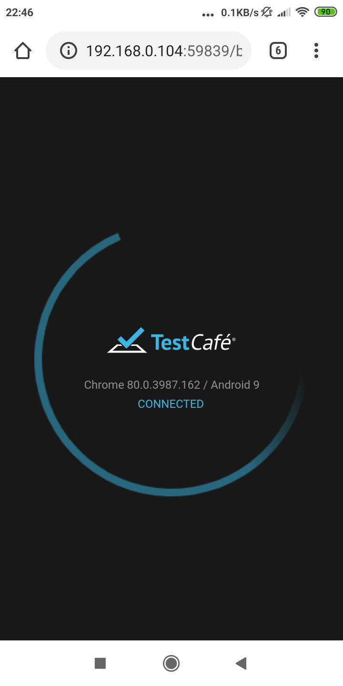
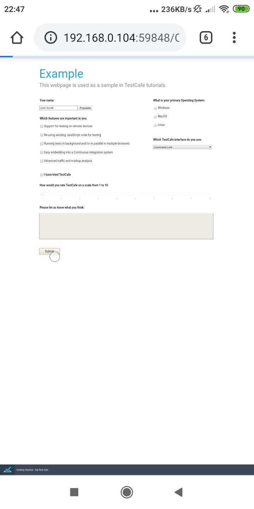
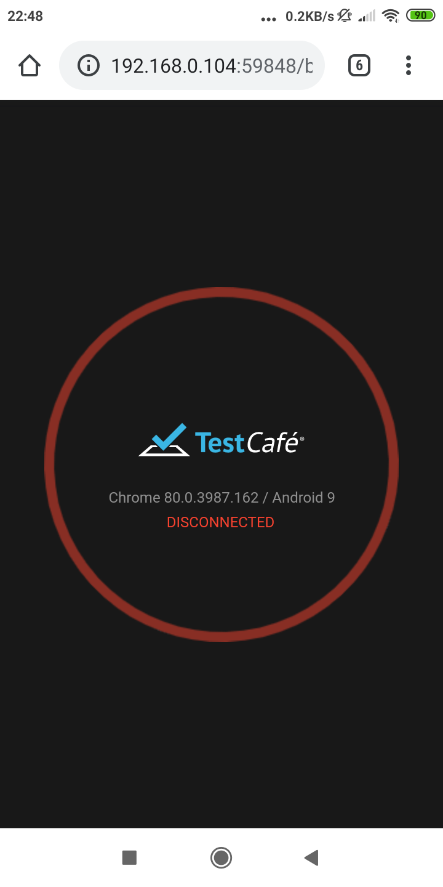
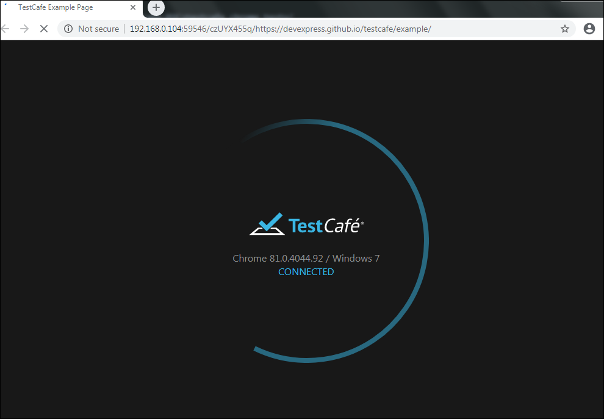
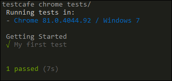

# # wiki 📚 

🦮 This is a mini Wiki for quick help.

For this POC, I created a file `test.js` , you can find it under `testcafe-POC\tests\`

---

## Demo run screen shots ( testcafe in action )

### MOBILE Run

|**1. launch of browser** `chrome`|**2. Run in Progress** `Android`|**3. disconnected or run ends**|
|-------|------|------|
|| ||

---

### DESKTOP Run

|**2. launch of browser** `chrome` on Desktop |**2. Finished run** on `CLI`
|-------|------|
|| |

---

Let's go back to Previous(main) [README.md]

---

[\\]: <> (This is a commented section and should not be visible in README file)

[README.md]: <https://github.com/eaccmk/testcafe-POC>
